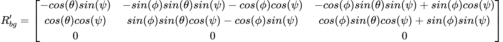

# Project: Building an Estimator

This is the writeup for my implementation of the *Building an Estimator* in C++ project. In each section below I address all the required rubric items. The animation below shows the final result: the quadrotor controller implemented in my previous project follows the test trajectory successfully.

<p align="center">

</p>


## Determining measurement noise

Given a set of sampled sensor measurements from a stationary quadrotor the noise standard deviation can be calculated according to the following equation:

<!-- $
\begin{align*}
\hat{\sigma}^2 = {1\over n} \sum_{i=1}^{n} (x_i-\hat{x})^2
\end{align*}
$ --> 

In this case I made use of the std() routine from the numpy library:

```cpp
gps_xs = np.genfromtxt("../config/log/Graph1.txt",delimiter=",",skip_header=True)
sigma = np.std(gps_xs[:,1])
x_bar = np.mean(gps_xs[:,1])

imu_axs = np.genfromtxt("../config/log/Graph2.txt",delimiter=",",skip_header=True)
sigma = np.std(imu_axs[:,1])
x_bar = np.mean(imu_axs[:,1])
```

After updating the configuration the measurements are now captured within the 68th percentile:

<p align="center">

</p>

## Implementing rate gyro attitude integration

Using the supplied Quaternion class I was able integrate the IMU body rate inputs and so update the estimator to use Nonlinear complementary filtering for attitude according to the equations below:

<!-- $
\begin{align*}
\bar{q_t} = dq*q_t \\
\bar{\theta_t}=Pitch(\bar{q_t}) \\
\bar{\phi_t}=Roll(\bar{q_t})
\end{align*}
$ --> 


```cpp
auto attitudeEst = Quaternion<float>::FromEuler123_RPY(rollEst,pitchEst,ekfState(6));
auto attitudePred = attitudeEst.IntegrateBodyRate(gyro,dtIMU);
auto predictedPitch = attitudePred.Pitch();
auto predictedRoll = attitudePred.Roll();
ekfState(6) = attitudePred.Yaw();
```

This results in improved attitude tracking as seen when running Scenario #7:

<p align="center">

</p>

## Implementing prediction step elements

Firstly the PredictState() method was updated which integrates the current velocity and IMU acceleration inputs to calculate the next predicted state.

<!-- $
\begin{align*}
x_{t} =
 \begin{bmatrix}
    x \\
    y \\
    z \\
    \dot{x} \\
    \dot{y} \\
    \dot{z} \\
    \psi
  \end{bmatrix} \\
\end{align*}
$ --> ,

<!-- $
\begin{align*}
\bar{x_t} = \hat{x_{t-1}} +
 \begin{bmatrix}
    \dot{x} \\
    \dot{y} \\
    \dot{z} \\
    \ddot{x} \\
    \ddot{y} \\
    \ddot{z} \\
    0
  \end{bmatrix} \varDelta T
\end{align*}
$ --> 


The IMU acceleration is rotated into the inertial frame and corrected for gravity, and then `predictedState` is calculated:

```cpp
auto accelInI = attitude.Rotate_BtoI(accel) + V3F(0,0,-CONST_GRAVITY);
VectorXf dState(QUAD_EKF_NUM_STATES);
dState(0) = curState(3);
dState(1) = curState(4);
dState(2) = curState(5);
dState(3) = accelInI.x;
dState(4) = accelInI.y;
dState(5) = accelInI.z;
dState(6) = 0;
predictedState = curState + (dState * dt);
```

This results in the predicted state closely following the true state for Scenario#8.

<p align="center">

</p>

Preparing to update the state covariance, the `GetRbgPrime()` method is implemented according to the following equation:

<!-- $
\begin{align*}
R'_{bg} = \begin{bmatrix}
  -cos(\theta)sin(\psi) & -sin(\phi)sin(\theta)sin(\psi) - cos(\phi)cos(\psi) &  -cos(\phi)sin(\theta)sin(\psi) + sin(\phi)cos(\psi) \\
  cos(\theta)cos(\psi) & sin(\phi)sin(\theta)cos(\psi) - cos(\phi)sin(\psi) & cos(\phi)sin(\theta)cos(\psi) + sin(\phi)sin(\psi) \\
  0 & 0 & 0
  \end{bmatrix}
\end{align*}
$ --> 

In code I have formatted as follows for readability and to assist with cross-checking against the referenced formula:

```cpp
const auto phi = roll;
const auto theta = pitch;
const auto psi = yaw;
RbgPrime(0,0) = -cosf(theta)*sinf(psi);
RbgPrime(0,1) = -sinf(phi)*sinf(theta)*sinf(psi) - cosf(phi)*cosf(psi);
RbgPrime(0,2) = -cosf(phi)*sinf(theta)*sinf(psi) + sinf(phi)*cosf(psi);

RbgPrime(1,0) = cosf(theta)*cosf(psi);
RbgPrime(1,1) = sinf(phi)*sinf(theta)*cosf(psi) - cosf(phi)*sinf(psi);
RbgPrime(1,2) = cosf(phi)*sinf(theta)*cosf(psi) + sinf(phi)*sinf(psi);
```

The next step is to remove the gravity reaction force from the measured IMU acceleration vector, which is used as a control input for the EKF:

```cpp
auto attitude = Quaternion<float>::FromEuler123_RPY(rollEst, pitchEst, ekfState(6));
auto gravity = V3F(0,0,-CONST_GRAVITY);
auto accelInB = accel + attitude.Rotate_ItoB(gravity);
```

Then the elements of the Jacobian matrix are prepared to match the reference equation below:

<!-- $
\begin{align*}
G_t = g'(x_t,u_t,\varDelta t) = \begin{bmatrix}
  1 & 0 & 0 & \varDelta t & 0           & 0           & 0 \\
  0 & 1 & 0 & 0           & \varDelta t & 0           & 0 \\
  0 & 0 & 1 & 0           & 0           & \varDelta t & 0 \\
  0 & 0 & 0 & 1           & 0           & 0           & R'_{bg}[0:]u_t[0:3]\varDelta t \\
  0 & 0 & 0 & 0           & 1           & 0           & R'_{bg}[1:]u_t[0:3]\varDelta t \\
  0 & 0 & 0 & 0           & 0           & 1           & R'_{bg}[2:]u_t[0:3]\varDelta t \\
  0 & 0 & 0 & 0           & 0           & 0           & 1 \\
  \end{bmatrix}
\end{align*}
$ --> 

As the matrix `gPrime` was already initialized to the identity matrix this leaves a further 6 elements to be assigned as follows:

```cpp
for(int i=0;i<3;++i) {
  gPrime(i,i+3) = dt;
}
```

```cpp
VectorXf ut(3);
ut << accelInB.x, accelInB.y, accelInB.z;
for(int i=0;i<3;++i) {
  gPrime(i+3,6) = RbgPrime.row(i).dot(ut)*dt;
}
```

Now state covariance can be predicted as per the EKF algorithm step:

<!-- $
\begin{align*}
\bar{\Sigma_T}=G_t\Sigma_{t-1}G_t^T+Q_t
\end{align*}
$ --> 

As recommended the transpose of `gPrime` is calculated using the transposeInPlace() method. This saves an unnecessary extra memory allocation and copying for the large matrix:

```cpp
ekfCov = gPrime * ekfCov;
gPrime.transposeInPlace();
ekfCov = ekfCov * gPrime + Q;
```

After this the process noise paramaters in `config/QuadEstimatorEKF.txt` were tuned so that the covariance better tracks the data:

<p align="center">

</p>

## Implementing magnetometer update

In this step the magnetometer measurement is incorporated into the estimator. To achieve this the following vectors are supplied to the EKF update function:

<!-- $
\begin{align*}
z_t = \begin{bmatrix}
  \psi
  \end{bmatrix}
\end{align*}
$ --> ,

<!-- $
\begin{align*}
h(x_t) = \begin{bmatrix}
  x_{t,\psi}
  \end{bmatrix}
\end{align*}
$ --> ,

<!-- $
\begin{align*}
h'(x_t) = \begin{bmatrix}
  0 & 0 & 0 & 0 & 0 & 0 & 1
  \end{bmatrix}
\end{align*}
$ --> ,

<!-- $
\begin{align*}
normalise \space h(x_t) : -\pi <= z_t[0] - h(x_t)[0] < \pi
\end{align*}
$ --> 


This is implemented in code as follows, being sure to arrange `zFromX` such that the yaw difference will be +/- 180 degrees.

```cpp
hPrime(0,6) = 1;
zFromX(0) = z(0) - AngleNormF(magYaw - ekfState(6));
```

And now running Scenario #10 the estimated standard deviation can be seen to capture the error:

<p align="center">

</p>

## Implementing GPS update

In this step the GPS measurement is incorporated into the estimator. To achieve this the following vectors are supplied to the EKF update function:


<!-- $
\begin{align*}
z_t = \begin{bmatrix}
  x \\
  y \\
  z \\
  \dot{x} \\
  \dot{y} \\
  \dot{z} \\
  \end{bmatrix}
\end{align*}
$ --> ,

<!-- $
\begin{align*}
h(x_t) = \begin{bmatrix}
  x_{t,x} \\
  x_{t,y} \\
  x_{t,z} \\
  x_{t,\dot{x}} \\
  x_{t,\dot{y}} \\
  x_{t,\dot{z}} \\
  \end{bmatrix}
\end{align*}
$ --> ,

<!-- $
\begin{align*}
h'(x_t) = \begin{bmatrix}
  1 & 0 & 0 & 0 & 0 & 0 & 0 \\
  0 & 1 & 0 & 0 & 0 & 0 & 0 \\
  0 & 0 & 1 & 0 & 0 & 0 & 0 \\
  0 & 0 & 0 & 1 & 0 & 0 & 0 \\
  0 & 0 & 0 & 0 & 1 & 0 & 0 \\
  0 & 0 & 0 & 0 & 0 & 1 & 0 \\
  \end{bmatrix}
\end{align*}
$ --> 

This is implemented in code as follows:

```cpp
hPrime.leftCols(6).setIdentity();
zFromX = ekfState.head(6);
```

At this this stage the QuadController implementation from the previous project was incorporated and tuned. At this point the estimator was able complete the entire simulation cycle for Scenarion #11 with estimated position error of < 1m.


